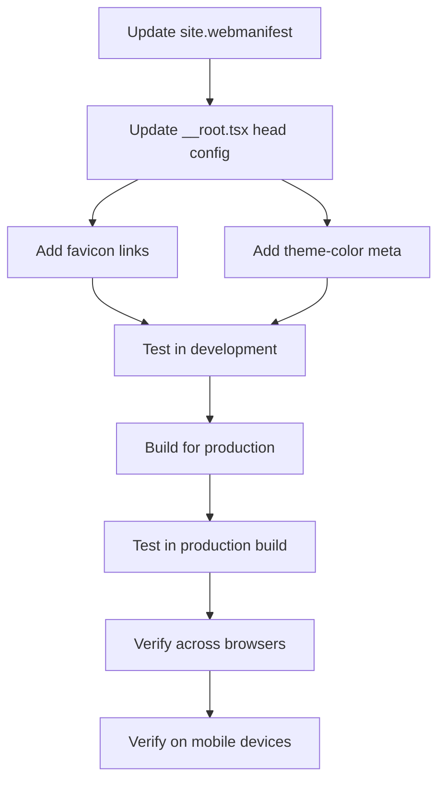

# Favicon Integration Plan for TanStack Start

## Overview
This plan outlines the steps to properly integrate the favicon bundle in the `public` directory with TanStack Start, ensuring favicons display correctly across all browsers and devices.

## Current State Analysis

### Favicon Files Available
- `favicon.ico` - Legacy favicon for older browsers
- `favicon.svg` - Modern SVG favicon with dark mode support
- `favicon-96x96.png` - PNG favicon for various uses
- `apple-touch-icon.png` - iOS home screen icon
- `web-app-manifest-192x192.png` - PWA icon (192x192)
- `web-app-manifest-512x512.png` - PWA icon (512x512)
- `manifest.json` - Web app manifest (legacy)
- `site.webmanifest` - Modern web manifest

### Current Implementation
The [`__root.tsx`](src/routes/__root.tsx:1) file currently has:
- Basic meta tags (charset, viewport, title)
- Stylesheet link
- **Missing**: All favicon-related links and meta tags

## Implementation Plan

### Step 1: Update Web Manifest Files
Both `manifest.json` and `site.webmanifest` need to be updated to reference the correct icon files and branding.

**Actions:**
- Update `site.webmanifest` to use correct app name and icon paths
- Ensure `manifest.json` references the correct icons
- Decide which manifest to use (recommend `site.webmanifest` as primary)

### Step 2: Add Favicon Links to Root Route
Update [`src/routes/__root.tsx`](src/routes/__root.tsx:24) to include all necessary favicon links in the `head` configuration.

**Required Links:**
```typescript
links: [
  // Existing stylesheet
  { rel: "stylesheet", href: appCss },
  
  // SVG favicon (modern browsers with dark mode support)
  { rel: "icon", type: "image/svg+xml", href: "/favicon.svg" },
  
  // PNG fallback for browsers without SVG support
  { rel: "icon", type: "image/png", sizes: "96x96", href: "/favicon-96x96.png" },
  
  // Legacy ICO for older browsers
  { rel: "icon", type: "image/x-icon", href: "/favicon.ico" },
  
  // Apple touch icon for iOS devices
  { rel: "apple-touch-icon", sizes: "180x180", href: "/apple-touch-icon.png" },
  
  // Web app manifest
  { rel: "manifest", href: "/site.webmanifest" }
]
```

### Step 3: Add Theme Color Meta Tags
Add theme color meta tags to the `meta` array for better browser integration.

**Required Meta Tags:**
```typescript
meta: [
  // Existing meta tags
  { charSet: "utf-8" },
  { name: "viewport", content: "width=device-width, initial-scale=1" },
  { title: "McQueen Logistics - Top Notch Service" },
  
  // Theme color for browser UI
  { name: "theme-color", content: "#ffffff" },
  
  // Optional: Description for SEO
  { 
    name: "description", 
    content: "McQueen Logistics - Top Notch Service for all your logistics needs" 
  }
]
```

### Step 4: Verify Public Directory Serving
Ensure TanStack Start/Vite is configured to serve files from the `public` directory correctly.

**Verification:**
- Check that `public` directory is at project root
- Verify Vite serves static files from `public` automatically
- Test that files are accessible at `/favicon.svg`, `/apple-touch-icon.png`, etc.

### Step 5: Update Web Manifest Content
Update [`public/site.webmanifest`](public/site.webmanifest:1) with correct branding:

```json
{
  "name": "McQueen Logistics",
  "short_name": "McQueen",
  "icons": [
    {
      "src": "/web-app-manifest-192x192.png",
      "sizes": "192x192",
      "type": "image/png",
      "purpose": "any maskable"
    },
    {
      "src": "/web-app-manifest-512x512.png",
      "sizes": "512x512",
      "type": "image/png",
      "purpose": "any maskable"
    }
  ],
  "theme_color": "#ffffff",
  "background_color": "#ffffff",
  "display": "standalone",
  "start_url": "/"
}
```

## Implementation Sequence



## Testing Checklist

### Desktop Browsers
- [ ] Chrome/Edge - Check tab favicon
- [ ] Firefox - Check tab favicon
- [ ] Safari - Check tab favicon
- [ ] Check dark mode switching (SVG favicon should adapt)

### Mobile Devices
- [ ] iOS Safari - Check bookmark icon
- [ ] iOS - Add to home screen, verify icon
- [ ] Android Chrome - Check tab favicon
- [ ] Android - Add to home screen, verify icon

### PWA Features
- [ ] Verify manifest loads correctly
- [ ] Check install prompt shows correct icon
- [ ] Verify theme color applies to browser UI

## File Changes Summary

### Files to Modify
1. [`src/routes/__root.tsx`](src/routes/__root.tsx:1) - Add favicon links and meta tags
2. [`public/site.webmanifest`](public/site.webmanifest:1) - Update branding and icon paths

### Files to Keep
- All favicon files in `public/` directory
- Both `manifest.json` and `site.webmanifest` (for compatibility)

## Expected Outcome

After implementation:
- Favicons display correctly in all modern browsers
- Dark mode users see appropriate favicon variant
- iOS users can add app to home screen with proper icon
- PWA installation shows correct branding
- Browser UI reflects theme color
- All devices show appropriate icon sizes

## Notes

- The SVG favicon includes dark mode support via CSS media queries
- TanStack Start serves static files from `public/` automatically
- No build configuration changes needed in Vite
- The `head` function in root route is the correct place for all meta/link tags
- Order of favicon links matters (SVG first for modern browsers, fallbacks after)

## References

- [TanStack Router Head API](https://tanstack.com/router/latest/docs/framework/react/api/router/createRootRouteFunction#head)
- [Web App Manifest Specification](https://developer.mozilla.org/en-US/docs/Web/Manifest)
- [Favicon Best Practices](https://evilmartians.com/chronicles/how-to-favicon-in-2021-six-files-that-fit-most-needs)
